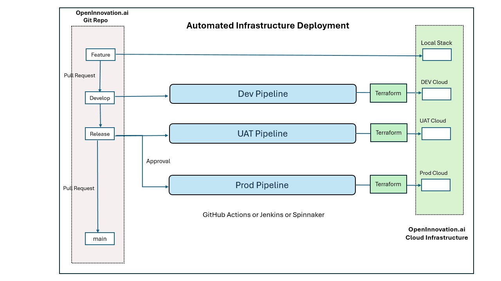

# Microservices and Infrastructure
## 1. Choose the infrastructure platform to use
Selecting Infrastructure Platform, depends on multiple factors and use cases.

Here are few common options for Infrastructure platforms:
- Self hosted
- Public Cloud Provider
- Hybrid

**Automated deployments:**
Automated deployments of Infrastructure and Application is achievable on both Private(on-prem) and Public cloud setup.

**Autoscaling:**
Autoscaling on on-prem setup depends on existing infrastructure and could become a bottleneck if there are less number of VMs to serve the load.
In Public Cloud, Autoscaling is one of the most useful feature which helps in allotting more compute resources based on the load, which is significantly higher compared to small/moderate on-prem data centers.
For short term load serving, Public cloud’s Autoscaling could be more cost effective (pay as you go) compared to on-prem setup where we need Capacity planning and maintain additional Infrastructure provisioned before the load burst.

**High Availability/Fault Tolerance:**
We can achieve High Availability in both On-prem and Public Cloud, but it's much easier and cost-effective to do in Public cloud where we can create subnets in another Availability Zone and have VMs serving traffic behind the load balancer.

But Fault Tolerant setup for mission critical applications requires redundant Infrastructure which should be in another region, so that even regional outages do not impact the service availability.

We can achieve Fault Tolerance in Public cloud easily since there are multiple Regions available, but it would definitely cost more to continuously run redundant setup.
For on-prem we need to have an additional data center in another location/zone/region with redundant infrastructure.

Setup for Fault Toleration costs more in both on-prem and Public Cloud, but Public cloud could still be cheaper if we keep redundant setup with minimum number of VMs and Auto-scale when the load increases in the event of outage.


**My Selection of Infrastructure Platform:**

If we already have Data centers available with enough capacity, I’ll select the on-prem Infrastructure Platform but if we have limited capacity and expect higher load then I’ll select the Public Cloud Platform.

Also,if there are concerns related to Compliance, I’ll definitely use on-prem Infrastructure Platform to have more control

For on-prem setup, we can use Platform as a Service(PaaS) such as Openshift, Rancher, Cloud Foundry, etc.

**Since I do not have on-prem setup, I'll use AWS Cloud Provider as Infrastructure Platform**

## 2. Orchestrator of choice:
Orchestration of Frontend/Backend microservices and Database tier can be segregated as below:

**Frontend and Backend Microservices:**
- Kubernetes **(Preferred Option)**

     _<u>Pros:</u> Vendor Agnostic, flexibility, customization and control_


- Container as a Service (CaaS) - such as ECS, Cloud Foundry

    _<u>Pros:</u> Simplified deployment and zero to minimum maintenance_

**Database:**

- **Kubernetes** Cluster running **Postgres Operator** - https://cloudnative-pg.io/ **(Preferred Option)**

- Managed Database as a Service - (**DBaaS**)

    _<u>Pros</u>: If we are using CaaS, managed Database will be make more sense due to less maintenance efforts_


_Kubernetes can be used for both application container/pods orchestration as well as running databases using **Postgres Operator**, this setup is also **vendor agnostic** compared to another option of using Cloud Providers’s CaaS and managed DBaaS._

**My selection:
Kubernetes**

## 3. Describe the solution to automate the infrastructure deployment and prepare the most important snippets of code/configuration

**Automated Infrastructure Deployment** can be achieved by combining IaC with CI/CD as described below:

1. Infrastructure should be setup using Infrastructure as a Code (IaC) approach
2. Deployment should be performed using CI/CD pipeline

### **IaC Tool Options:**

**Terraform:**

If we already have TFC/TFE, we can use the **Terraform Workspace** feature to isolate different environments as well as their components (e.g Compute, DB, Networking, etc.)


**Terragrunt:**

Terragrunt can be very useful if we have complex infrastructure, with multi-region, multiple infrastructure components.
Also it does NOT require Terraform subscription of TFC, which will save cost, but then we would need to maintain statefile and locking on our own, as well server to execute the IaC jobs.


### Automated Deployment (CI/CD):
- CI/CD tools such as **Spinnaker, GitHub Actions, Jenkins** could be used to execute the Infrastructure Code (Terraform, Terragrunt, Pulumi, etc.)
- Deployment pipelines should be triggered based on the changes in the respective branches **Dev/UAT/PROD**, with additional control for Production promotion


#### Pseudo Code:
Sample CI/CD stages to execute IaC Pipeline:

```
TRIGGER: Code CheckIn/Pull Request

STAGE: Code Validation/Testing
STAGE: Code Security Check (e.g. tfsec)
STAGE: Plan
STAGE: Approval stage
STAGE: Apply
```

Below is sample representation of Automated Infrastructure Deployment using Git flow:




**My Selection:**

For basic configuration, I’ll prefer to use the free Terraform plan and using Terraform Workspaces for each Infrastructure component.
And for CI/CD pipeline, I’ll use GitHub Actions pipeline


## [IaC] Terraform Code Example for setting up Kubernetes (as EKS on AWS Cloud):

**Please refer Terraform code for creating EKS cluster here** - https://github.com/say2imran/microservices_and_infra/blob/feature/microservices_infra/infrastructure_repo/compute_repo/eks.tf 

In order to enhance **High Availability** of EKS cluster as well as workload running in the cluster, we would need to following configuration at Cluster level and Workload deployments:

### Managed node groups: ###

1. **'desired_capacity'** can be increased to have multiple node instances in each Availability Zone to support the workload
2. We can also tweak **min/max/desired** capacity parameters for enabling better Auto Scalability based on use case
3. **'capacity_type'** should be changed to **ON_DEMAND** instead of SPOT type, to ensure that servers are not taken away, causing service impact.


### Multi-AZ NAT Gateway ###
 **'single_nat_gateway'** set to ‘false’ and **‘one_nat_gateway_per_az’** set to 'true' 

    This is to ensure that each Private subnet has its own NAT Gateway for outbound connection, this could avoid an outage due to AZ independent architecture.

_However, error handling in application code needs to take care of NAT connectivity issues, where we would need to cause POD to fail and requests will be redirected to the other PODs running in the Subnets having access for outbound connections. It could be added as a dependent service and checked at the time of initialization, but this could create an Availability issue for the main application instance initialization._

### Multi-AZ Subnets (Private/Public): ###

Here we have provided configuration to have 3 Private/Public subnets for EKS Cluster, for High Availability.

For **Fault Tolerance**, we can create a Multi-Region setup with a **failover routing policy in Route53**, but it has its own challenges and additional cost.

### POD Disruption Budgets (PDBs): ###

We can configure Pods to have PDB setup, to control max number of PODs being unavailable to increase HA

### POD Topology Spread: ###

It controls POD Topology/distribution skew, which could cause performance impact if
any of the k8s nodes goes down containing a larger number of PODs due to skewed
Distribution.


### Max Unavailable Percentage: ###
max_unavailable_percentage = X, which Allow up to X% of nodes to be unavailable during updates, its set to 25% in our code

# [IaC] Terraform Code Example for setting up Postgres Database on Kubernetes: #

Sample code: https://github.com/say2imran/microservices_and_infra/blob/feature/microservices_infra/infrastructure_repo/database_repo/postgres.tf 

Here we have done following configuration to make Postgres Database Highly Available

**High Availability in Postgres Operator:**

    Multiple replicas: replicaCount = 3

**Operator Level - Topology Key** has been set as per Availability Zones with allowed skew of 1, which means DB Pods will be assigned to different zone, in our case we have 3 AZs as well as replicas set to 3, so each AZ will have a Database Pod

	topologyKey: "topology.kubernetes.io/zone"
    maxSkew = 1

High Availability in **Postgres Cluster**:

	instances = 3

Pod Disruption Budget(PDB) for Postgres Pods:

	minAvailable = 2

**Anti-affinity** in Postgres Cluster Pods, which should again to prevent multiple pods in same zone:

    affinity = {
        enablePodAntiAffinity = true
        topologyKey = "topology.kubernetes.io/zone"
      }


I have also configured **longhorn as StorageClass** with Backup enabled as well as multi-replicas(3 instances), it will provide better HA to the PVs being used by Postgres Cluster

**To summarize, we have enabled HA in following layer:**

    EKS Cluster Level HA
    Postgres Operator Level HA
    Postgres Cluster Level HA
    StorageClass Level HA
