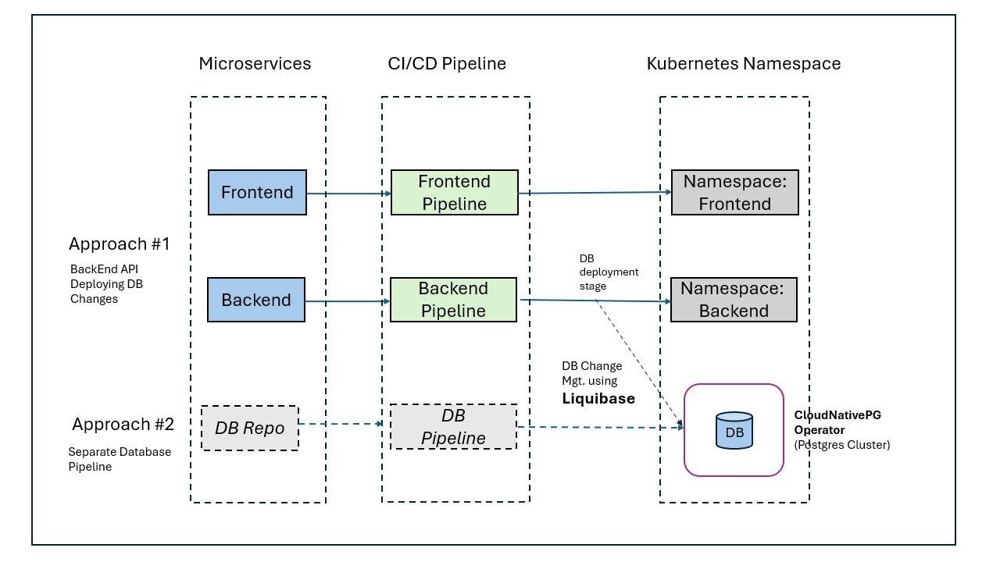

# Microservices and Infrastructure

#### Summary:
 1. Choose the infrastructure platform to use: **AWS** _([Click here for more details](https://github.com/say2imran/microservices_and_infra#1-choose-the-infrastructure-platform-to-use))_

2. Orchestrator of choice: **Kubernetes** _([Click here for more details](https://github.com/say2imran/microservices_and_infra#2-orchestrator-of-choice))_

3. Describe the solution to automate the infrastructure deployment and prepare the most important snippets of code/configuration: **Terraform** _([Click here for more details](https://github.com/say2imran/microservices_and_infra#3-describe-the-solution-to-automate-the-infrastructure-deployment-and-prepare-the-most-important-snippets-of-codeconfiguration))_

4. Describe the solution to automate the microservices deployment and prepare the most important snippets of code/configuration: **Separate CI and CD pipelines** _([Click here for more details](https://github.com/say2imran/microservices_and_infra#4-describe-the-solution-to-automate-the-microservices-deployment-and-prepare-the-most-important-snippets-of-codeconfiguration))_

5. Describe the release lifecycle for the different components: [Click here for details](https://github.com/say2imran/microservices_and_infra#5-describe-the-release-lifecycle-for-the-different-components)

6. Describe the testing approach for the infrastructure: [Click here for details](https://github.com/say2imran/microservices_and_infra#6-describe-the-testing-approach-for-the-infrastructure)

7. Describe the monitoring approach for the solution: _[Click here for more details](https://github.com/say2imran/microservices_and_infra#7-describe-the-monitoring-approach-for-the-solution)_
    - Infrastructure Metrics: Prometheus and Thanos
    - Application Traces/Metrics: OTeL (Jaeger, Prometheus)
    - Application Logging:  Grafana Loki

---
## 1. Choose the infrastructure platform to use
Selecting Infrastructure Platform, depends on multiple factors and use cases.

Here are few common options for Infrastructure platforms:
- Self hosted
- Public Cloud Provider
- Hybrid

**Automated deployments:**
Automated deployments of Infrastructure and Application is achievable on both Private(on-prem) and Public cloud setup.

**Autoscaling:**
Autoscaling on on-prem setup depends on existing infrastructure and could become a bottleneck if there are less number of VMs to serve the load.
In Public Cloud, Autoscaling is one of the most useful feature which helps in allotting more compute resources based on the load, which is significantly higher compared to small/moderate on-prem data centers.
For short term load serving, Public cloud’s Autoscaling could be more cost effective (pay as you go) compared to on-prem setup where we need Capacity planning and maintain additional Infrastructure provisioned before the load burst.

**High Availability/Fault Tolerance:**
We can achieve High Availability in both On-prem and Public Cloud, but it's much easier and cost-effective to do in Public cloud where we can create subnets in another Availability Zone and have VMs serving traffic behind the load balancer.

But Fault Tolerant setup for mission critical applications requires redundant Infrastructure which should be in another region, so that even regional outages do not impact the service availability.

We can achieve Fault Tolerance in Public cloud easily since there are multiple Regions available, but it would definitely cost more to continuously run redundant setup.
For on-prem we need to have an additional data center in another location/zone/region with redundant infrastructure.

Setup for Fault Toleration costs more in both on-prem and Public Cloud, but Public cloud could still be cheaper if we keep redundant setup with minimum number of VMs and Auto-scale when the load increases in the event of outage.


**My Selection of Infrastructure Platform:**

If we already have Data centers available with enough capacity, I’ll select the on-prem Infrastructure Platform but if we have limited capacity and expect higher load then I’ll select the Public Cloud Platform.

Also,if there are concerns related to Compliance, I’ll definitely use on-prem Infrastructure Platform to have more control

For on-prem setup, we can use Platform as a Service(PaaS) such as Openshift, Rancher, Cloud Foundry, etc.

> [!IMPORTANT]
> **My selection:**
> Since I do not have on-prem setup, I'll use AWS Cloud Provider as Infrastructure Platform

## 2. Orchestrator of choice:
Orchestration of Frontend/Backend microservices and Database tier can be segregated as below:

**Frontend and Backend Microservices:**
- Kubernetes **(Preferred Option)**

     _<u>Pros:</u> Vendor Agnostic, flexibility, customization and control_


- Container as a Service (CaaS) - such as ECS, Cloud Foundry

    _<u>Pros:</u> Simplified deployment and zero to minimum maintenance_

**Database:**

- **Kubernetes** Cluster running **Postgres Operator** - https://cloudnative-pg.io/ **(Preferred Option)**

- Managed Database as a Service - (**DBaaS**)

    _<u>Pros</u>: If we are using CaaS, managed Database will be make more sense due to less maintenance efforts_


_Kubernetes can be used for both application container/pods orchestration as well as running databases using **Postgres Operator**, this setup is also **vendor agnostic** compared to another option of using Cloud Providers’s CaaS and managed DBaaS._

>**My selection:**
>Kubernetes

## 3. Describe the solution to automate the infrastructure deployment and prepare the most important snippets of code/configuration

**Automated Infrastructure Deployment** can be achieved by combining IaC with CI/CD as described below:

1. Infrastructure should be setup using Infrastructure as a Code (IaC) approach
2. Deployment should be performed using CI/CD pipeline

### **IaC Tool Options:**

**Terraform:**

If we already have TFC/TFE, we can use the **Terraform Workspace** feature to isolate different environments as well as their components (e.g Compute, DB, Networking, etc.)


**Terragrunt:**

Terragrunt can be very useful if we have complex infrastructure, with multi-region, multiple infrastructure components.
Also it does NOT require Terraform subscription of TFC, which will save cost, but then we would need to maintain statefile and locking on our own, as well server to execute the IaC jobs.


### Automated Deployment (CI/CD):
- CI/CD tools such as **Spinnaker, GitHub Actions, Jenkins** could be used to execute the Infrastructure Code (Terraform, Terragrunt, Pulumi, etc.)
- Deployment pipelines should be triggered based on the changes in the respective branches **Dev/UAT/PROD**, with additional control for Production promotion


#### Pseudo Code:
Sample CI/CD stages to execute IaC Pipeline:

```
TRIGGER: Code CheckIn/Pull Request

STAGE: Code Validation/Testing
STAGE: Code Security Check (e.g. tfsec)
STAGE: Plan
STAGE: Approval stage
STAGE: Apply
```

Below is sample representation of Automated Infrastructure Deployment using Git flow:


**My Selection:**

> For basic configuration, I’ll prefer to use the free Terraform plan and using Terraform Workspaces for each Infrastructure component.
And for CI/CD pipeline, I’ll use GitHub Actions pipeline


## [IaC] Terraform Code Example for setting up Kubernetes (as EKS on AWS Cloud): 

**Please refer Terraform code for creating EKS cluster here** - https://github.com/say2imran/microservices_and_infra/blob/feature/microservices_infra/tf_infra_compute_repo/eks.tf 

In order to enhance **High Availability** of EKS cluster as well as workload running in the cluster, we would need to following configuration at Cluster level and Workload deployments:

### Managed node groups: ###

1. **'desired_capacity'** can be increased to have multiple node instances in each Availability Zone to support the workload

2. We can also tweak **min/max/desired** capacity parameters for enabling better Auto Scalability based on use case

3. **'capacity_type'** should be changed to **ON_DEMAND** instead of SPOT type, to ensure that servers are not taken away, causing service impact.

```
capacity_type  = "ON_DEMAND"
desired_capacity = 3 
min_size         = 3
max_size         = 10 
```


### Multi-AZ NAT Gateway ###
 **'single_nat_gateway'** set to ‘false’ and **‘one_nat_gateway_per_az’** set to 'true' 

This is to ensure that each Private subnet has its own NAT Gateway for outbound connection, this could avoid an outage due to AZ independent architecture.

```
enable_nat_gateway         = true
single_nat_gateway         = false
```
_However, error handling in application code needs to take care of NAT connectivity issues, where we would need to cause POD to fail and requests will be redirected to the other PODs running in the Subnets having access for outbound connections. It could be added as a dependent service and checked at the time of initialization, but this could create an Availability issue for the main application instance initialization._

### Multi-AZ Subnets (Private/Public): ###

Here we have provided configuration to have 3 Private/Public subnets for EKS Cluster, for High Availability.
```
  azs             = ["us-west-2a", "us-west-2b", "us-west-2c"]
  private_subnets = ["10.0.1.0/24", "10.0.2.0/24", "10.0.3.0/24"]
  public_subnets  = ["10.0.101.0/24", "10.0.102.0/24", "10.0.103.0/24"]
```
For **Fault Tolerance**, we can create a Multi-Region setup with a **failover routing policy in Route53**, but it has its own challenges and additional cost.

### POD Disruption Budgets (PDBs): ###

We can configure Pods to have PDB setup, to control max number of PODs being unavailable to increase HA
```
resource "kubernetes_pod_disruption_budget" "eks_pdb" {
  metadata {
    name      = "eks-ha-pdb"
    namespace = "kube-system"
  }
```

### POD Topology Spread: ###

It controls POD Topology/distribution skew, which could cause performance impact if
any of the k8s nodes goes down containing a larger number of PODs due to skewed
Distribution.


### Max Unavailable Percentage: ###
max_unavailable_percentage = X, which Allow up to X% of nodes to be unavailable during updates, its set to 25% in our code
```
max_unavailable_percentage = 25

```
## [IaC] Terraform Code Example for setting up Postgres Database on Kubernetes: ##

Sample code: https://github.com/say2imran/microservices_and_infra/blob/feature/microservices_infra/tf_infra_database_repo/postgres.tf 

Here we have done following configuration to make Postgres Database Highly Available

**High Availability in Postgres Operator:**
```
Multiple replicas: replicaCount = 3
```
**Operator Level - Topology Key** has been set as per Availability Zones with allowed skew of 1, which means DB Pods will be assigned to different zone, in our case we have 3 AZs as well as replicas set to 3, so each AZ will have a Database Pod
```
topologyKey: "topology.kubernetes.io/zone"
maxSkew = 1
```
High Availability in **Postgres Cluster**:
```
instances = 3
```
Pod Disruption Budget(PDB) for Postgres Pods:
```
minAvailable = 2
```
**Anti-affinity** in Postgres Cluster Pods, which should again to prevent multiple pods in same zone:
```
affinity = {
    enablePodAntiAffinity = true
    topologyKey = "topology.kubernetes.io/zone"
    }
```

I have also configured **longhorn as StorageClass** with Backup enabled as well as multi-replicas(3 instances), it will provide better HA to the PVs being used by Postgres Cluster

**To summarize, we have enabled HA in following layer:**

    EKS Cluster Level HA
    Postgres Operator Level HA
    Postgres Cluster Level HA
    StorageClass Level HA

## 4. Describe the solution to automate the microservices deployment and prepare the most important snippets of code/configuration

Microservice can be deployed using either of the following approaches:

1. **CI and CD** in separate Pipelines (using combination of CI tools with CD tools - Spinnaker)
2. **CI + CD** in one Pipeline (using tools such as Jenkins, GitHub)
3. **GitOps** - Pull based approach (tools ArgoCD or FluxCD)


**My preference will be either option #1(separate CI and CD) or option #3 (GitOps approach) based on following benefits with each of the approaches.**

Benefits of **Option #1(Separate CI and CD)**:

1. Less time to market (code is built/packaged only once and could be deployed to multiple
environments)
2. Environment specific attributes can be parameterized at CD layer and Image rebuilding
can be avoided for Infra config changes
3. Better segregation of duties/control/decision
4. Less complex pipeline (compared to single Pipeline with a lot of stages)

Benefits of **Option #3(GitOps approach)**:

1. Better consistency across multiple deployments - Drift protection
2. Faster deployment, since there is continuous polling for changes
3. Good collaboration with PR/MR/Reviews and toll gate approvals for Prod releases


>My selection here will be using **approach #1 (separate CI and CD)**, also using **Kustomize for application configuration management** for specific environment (local/dev/staging/prod)


As per **12 Factor Methodology** for Microservices and **Cloud Native Application**, each Microservice should be considered as an individual service/application.

Hence following components should be separated for both Frontend and Backend Microservices:
* Codebase *(individual GIT Repos)*
* Build, Release, Run 

We need to make sure that both Frontend and Backend Microservices have separate Git Repositories as well as CI/CD pipeline for Build, Release and Run.

**Hence following CI and CD pipelines needs to be created separately for each Microservice (Frontend and Backend), using CI.yml/CD.yml files in respective repositories**

**CI Pipeline (pseudo code):**

```
TRIGGER: Code CheckIn/Pull Request

STAGE: Custom Coding Standards Rules
STAGE: SCA (Software Composition Analysis)
STAGE: SAST (Static Application Security Testing)
STAGE: Unit Testing
STAGE: Build
STAGE: Containerization (Package)
STAGE: Container Image Security Check(AquaSec/Trivy)
STAGE: Image/Artifacts Push

```

**CD Pipeline (pseudo code):**
```
TRIGGER: CI Pipeline

INPUT: Artifact ID
STAGE: Artifact Validation/Checks/Security Analysis
STAGE: Custom Infrastructure/Environment Checks
STAGE: Deployment (Image and K8s resources push)
STAGE: Integration Testing (non-prod)
STAGE: Verification

```

## 5. Describe the release lifecycle for the different components

Important setup and configuration to make release/deployment process easy:

1. Infrastructure tiers(compute/db/etc.) should be segregated into separate Git Repositories
(_e.g.  base_module_repo, db_module_repo, route53_module_repo, etc._)


2. Each Infrastructure component should be released as an individual component, having its own deployment pipeline


3. Environments(dev/staging/uat/prod) under each components should be mapped with its own Terraform Workspace


4. Interdependence between Infrastructure components should be resolved by referring the Workspaces references


**Approach for Major Infrastructure releases to avoid outages:**

Infrastructure upgrades/patching/changes should be thoroughly tested in lower environments.

In order to maintain **High Availability** during major upgrades, alternate Infrastructure stack can be provisioned using **Blue/Green** approach, and Application services traffic can be redirected using **Canary approach**

This will require us to create alternate setup in following order:

1. Create **new EKS cluster**(Major version upgrade)
2. Deploy Application Services (app CD pipelines to deploy services on new cluster)
3. Deploy **Route53** module with Canary configuration(initially 10% **weightage** to new cluster and 90% to services running on existing cluster)
4. _Testing/evaluation duration on new Infrastructure upgrade/version before redirecting 100% traffic_
5. **Update Route53** Canary configuration (100% to services on new cluster)
6. Destroy **old EKS** Cluster


**Another Approach:**

If we don't want to adopt **Blue/Green** approach of having new cluster, there is another approach which can be used to perform upgrade in rolling fashion:
1. Upgrade Control Plane version(example 1.25 ~> 1.26) by upgrading Terraform config
2. For self-managed worker node group we need to follow this cycle, steps can be written as a script to reduce manual efforts:
    - Disable Cluster Autoscaler
	- Launch new node with upgraded EKS version
	- Cordon existing node
	- Drain the node
	- Delete the node
	- Continue with above steps for all the nodes
	- Once all the nodes have been upgraded, enable Cluster Autoscaler

This can be automated by writing script to save manual efforts.

**Application(Microservices) Release Process:**

Application should be tested(unit test cases, integration, regression testing, etc.) and released in following order: _Dev → UAT(staging) → Prod_

As per 12 factor app, each Microservice should have its own Git Repository and CI/CD pipelines and also it should be deployed into its respective namespace.

If microservices maintains backward-compatibility versions _(v1, v2, etc.)_ then releases can be done independently, however some changes have dependency between FrontEnd, BackEnd and Database components, which requires release to be done in specific order.

**Database changes(DDLs, DMLs)** can be deployed either with BackEnd API or with a separate Pipeline.
**Automated Database Deployment** tools such as **Liquibase** can be used to perform DB object release via CI/CD pipeline.



## 6. Describe the testing approach for the infrastructure
We can perform following testing to different layers of Infrastructure:

1. Security Testing for Infrastructure components: 
    e.g.:
    - NACL – Network Access Control List
    - Ports
    - SSH (yes/no)
    - Firewall Rules
    - RBAC
    - etc.

2. Vulnerability Testing (SCA and SAST)
    
    _Tools - Snyk, Tfsec, Checkov, etc._

3. External Services Connectivity Testing

4. Load and Performance testing (usually before every major change)

5. Chaos Testing

    _If Load Testing is also including while performing Chaos Testing, it will provide benchmarking of load capacity in the duration of simulated CPU/Memory/IO attacks_

6. FinOps Testing

7. Configuration Drift Testing

8. MTTR or RTO Testing _(In simulated Disaster Recovery scenario, which could also be obtained by setting up new alternate environments using automation)_

## 7. Describe the monitoring approach for the solution
Monitoring should be performed for following components/attributes:

**1. Infrastructure**
- Compute: Node Health, CPU, Memory, IO
- Database: CPU, Memory, Disk, Capacity, IO
- Network Monitoring
- Number of Kubernetes Nodes, PODs
- Custom Events (e.g. SQS, Kinesis Shards, Custom AWS Eventbridge events)

**2. Application Monitoring (APM)**
- Availability, Uptime
- Metrics
- Logs
- Traces
- Application Custom Metrics
- Latency (p99, p90, p50, etc.)
- Error Response Codes

**3. Real User Monitoring**
- Real user monitoring for end-user monitoring

**4. SLI, SLO and Error Budget**


**Infrastructure Monitoring** should be configured for all tier – Frontend, Backend and Database


**APM (Application Performance Monitoring)** should be configured for both Frontend
and Backend Microservices which will help to understand the performance issues.

**Tracing** could help in understanding the service calls, performance bottlenecks and
insights of end to end service request call from **Frontend** to **Backend** and **Database**

**RUM – Real User Monitoring** – Should be set up for the Frontend tier to monitor user-centric perspective of performance, such as page load time, user interactions, etc.
_It could also provide meaningful information to identify the user's behavioral patterns._

Kubernetes Cluster monitoring for Nodes, PODs resources utilization should be set up to identify Cost saving opportunities, KubeCost can be used in here.

SLI should be setup based on SLOs, which should align with the value to the end user

**FinOps dashboard** for proactive cost management and monitoring (can be integrated into Grafana)

**I'll avoid following things while setting up Monitoring:**
- Irrelevant SLOs
- Too many alerts causing noise
- Too many dashboards to watch
- Unnecessary verbosity in logs
- Sensitive information in logs


### My selection of Monitoring Tools:

#### <u> Infrastructure Monitoring: </u>
- **Kubernetes Metrics:** Prometheus + Thanos
- **Visualization/Dashboard:** Grafana

#### <u>Application Monitoring:</u>
- **Metrics:** OTeL
- **Tracing:** OTeL
- **Logging:** OTeL**

        **OTel Logging is not GA for all the languages, status can be checked here - https://opentelemetry.io/status/ 
        If its Python or Golang which is in Development or Beta stage, we can use Grafana Loki which is also Open source and later migrate to OTeL
	
>#### <u>My OTel Stack:</u>
>- **Traces:** Jaeger _(Jaeger Backend: Opensearch or Elasticsearch)_
>- **Metrics:** Prometheus
>	- **Prometheus long-term storage**: Thanos
>	- **StorageClass for PVs:** Longhorn
>    - **Thanos Long-term storage:** S3
>- **Logging:** Grafana Loki	(S3 for storage)
>- **Dashboard:**
>    - **Metrics and Logs:** Grafana Dashboard
>    - **Traces:** Jaeger UI


